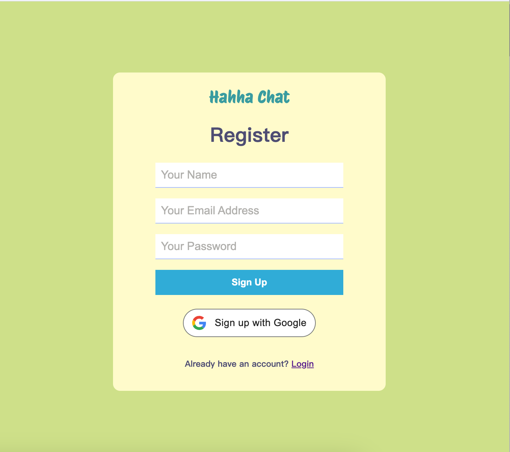
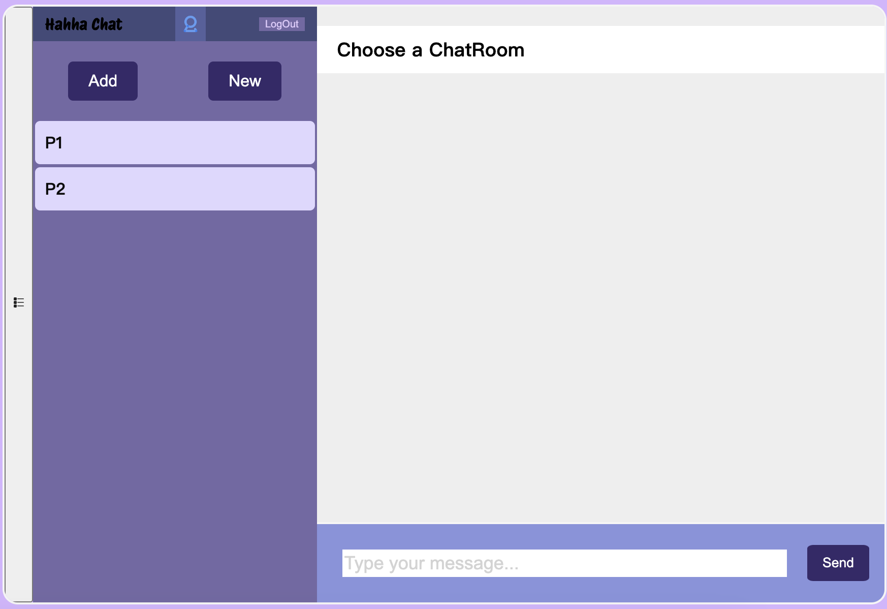

# Software Studio 2023 Spring Midterm Project

### Scoring

| **Basic components**                             | **Score** | **Check** |
| :----------------------------------------------- | :-------: | :-------: |
| Membership Mechanism                             | 15%       | Y         |
| Firebase page                                    | 5%        | Y         |
| Database read/write                              | 15%       | Y         |
| RWD                                              | 15%       | Y         |
| Chatroom                                         | 20%       | Y         |

| **Advanced tools**                               | **Score** | **Check** |
| :----------------------------------------------- | :-------: | :-------: |
| Using React                                      | 10%       | Y         |
| Third-Party Sign In                              | 1%        | Y         |
| Notification                                     | 5%        | Y         |
| CSS Animation                                    | 2%        | N         |
| Security                                         | 2%        | Y         |

| **Other useful functions**                         | **Score** | **Check** |
| :----------------------------------------------- | :-------: | :-------: |
| Name of functions                                  | 1~5%     | N         |

---

### How to setup your project

-  Describe STEP by STEP (i.e. `cd Midterm`, `npm install` ...)

### How to use 
1. Register
   - 會在一開始自動導向Register Page
     
     分別打入Name, Email Address, Password就可以按Sign Up註冊．

   - Sing up with Google 按下後會直接進入pop-up page，
     
     點進帳戶就可以使用Google帳號登入了
   - Register完會自動登入不用在重新登入就會直接進去Chat的部分

2. Login
   - 可以點下方紅色方塊進到登入畫面，或是將路徑的最後從 /register 改成 /login
    
   - 進入登入頁面後，直接可以輸入Email, PassWord，或按下方的 Sing in with Google就可以登入，大致和Register步驟相同，登入完也會自動跳轉到Chat的畫面
  
   - 也可以按下方Register的連接回到Register Page或是直接更改網址結尾成 /register

3. Home Page (ChatRoom)
   - 一開始是在開始畫面呈現 "Choose a ChatRoom"，你需要選一個你所在的ChatRoom進入
   

### Function description

- Describe your bonus function and how to use it.

### Firebase page link

- Your web page `URL`

### Others (Optional)

- Anything you want to say to TAs.

